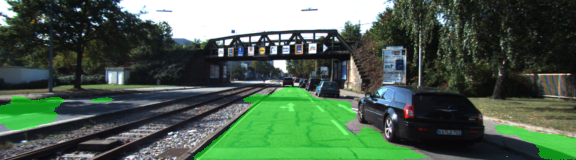

# Semantic Segmentation Project

## Goal

The goal of this project is to construct a fully convolutional neural network based on the VGG-16 image classifier architecture for performing semantic segmentation to identify drivable road area. (trained and tested on the KITTI data set).


## Architecture

A pre-trained VGG-16 network was converted to a fully convolutional network (FCNN) by modifying the final fully connected layer to a 1x1 convolution and setting the depth equal to the desired number of classes classes (two: road | not-road). We use skip connections, 1x1 convolutions on previous VGG layers (layers 3 and 4) and add them element-wise to upsampled (through transposed convolution) lower-level layers. Each convolution and transpose convolution layer includes its own kernel initializer and regularizer

### Loss function and Optimizer

The loss function for the network is cross-entropy, and an Adam optimizer is used.

### Training

The hyperparameters used for training are:

  - KEEP_PROB: 0.5
  - LEARNING_RATE: 0.0009
  - EPOCHS: 50
  - BATCH_SIZE: 10

## Results

| Epoch | Loss per batch |
|:-----:|:--------------:|
|   2   |      0.218     |
|   10  |      0.117     |
|   20  |      0.073     |
|   30  |      0.042     |
|   40  |      0.040     |
|   50  |      0.040     |


### Samples

Sample images of the output with segmentation class overlaid upon the original image in green.




---
### Setup
##### Frameworks and Packages
Make sure you have the following is installed:
 - [Python 3](https://www.python.org/)
 - [TensorFlow](https://www.tensorflow.org/)
 - [NumPy](http://www.numpy.org/)
 - [SciPy](https://www.scipy.org/)
##### Dataset
Download the [Kitti Road dataset](http://www.cvlibs.net/datasets/kitti/eval_road.php) from [here](http://www.cvlibs.net/download.php?file=data_road.zip).  Extract the dataset in the `data` folder.  This will create the folder `data_road` with all the training a test images.

##### Run
Run the following command to run the project:
```
python main.py
```
**Note** If running this in Jupyter Notebook system messages, such as those regarding test status, may appear in the terminal rather than the notebook.

### Submission
1. Ensure you've passed all the unit tests.
2. Ensure you pass all points on [the rubric](https://review.udacity.com/#!/rubrics/989/view).
3. Submit the following in a zip file.
 - `helper.py`
 - `main.py`
 - `project_tests.py`
 - Newest inference images from `runs` folder

