**Vehicle Detection Project**

The goals / steps of this project are the following:

* Perform a Histogram of Oriented Gradients (HOG) feature extraction on a labeled training set of images and train a classifier Linear SVM classifier
* Optionally, you can also apply a color transform and append binned color features, as well as histograms of color, to your HOG feature vector. 
* Note: for those first two steps don't forget to normalize your features and randomize a selection for training and testing.
* Implement a sliding-window technique and use your trained classifier to search for vehicles in images.
* Run the pipeline on a video stream (start with the `test_video.mp4` and later implement on full `project_video.mp4`) and create a heat map of recurring detections frame by frame to reject outliers and follow detected vehicles.
* Estimate a bounding box for vehicles detected.

[//]: # (Image References)
[image1a]: ./output_images/Training_images_for_vehicles.png
[image1b]: ./output_images/Training_images_for_non-vehicles.png
[image2a]: ./output_images/HOG_Features_Generated_for_Vehicle_Images.png
[image2b]: ./output_images/HOG_Features_Generated_for_Non-Vehicle_Images.png
[image3]: ./output_images/slide_windows_test1.png
[image4]: ./output_images/bboxes_test1.png
[image5]: ./output_images/heatmap_test1.png
[image6]: ./output_images/final_test1.png
[video1]: ./output_images/output.mp4

###  1. Histogram of Oriented Gradients (HOG)

#### 1.1 Extracted HOG features from the training images.

The code for this step is contained in cell 4 of the IPython notebook pipline.ipynb.  

I started by reading in all the `vehicle` and `non-vehicle` images.  There images are 64x64 pixels each. Here is an example of one of each of the `vehicle` and `non-vehicle` classes:

![alt text][image1a] 

![alt text][image1b] 

I then explored different color spaces and different `skimage.hog()` parameters (`orientations`, `pixels_per_cell`, and `cells_per_block`).  I grabbed random images from each of the two classes and displayed them to get a feel for what the `skimage.hog()` output looks like.

Here is an example using the `YCrCb` color space and HOG parameters of `orientations=9`, `pixels_per_cell=(8, 8)` and `cells_per_block=(2, 2)`:

![alt text][image2a]

![alt text][image2b]

#### 1.2 Final choice of Features.

I used the YCbCr color space to extract the features.

I tried various values of parameters and then settled at:
| Parameters       | Values      |
|:----------------:|:-----------:| 
| orientation      |     9       | 
| pix_per_cell     |     (8,8)   |
| cell_per_block   |     (2,2)   |
| spatial_size     |     (32,32) |
| hist_bins        |     32      |

I also augemented the HOG features with Color features by downsampling the image to 32,32 image and flattening it.
I also added a color histogram with 32 bins. These three together form the feature vector to the SVM classifier.

#### 1.3 Trained a classifier using your selected HOG features and color features.

I trained a linear Support vector classifier by splitting the data into training and test set as shown in `classifier.py`. The input images are of size 64x64 pixels. After extracting HOG, spatial and histogram features, we create a flat 8460 length feature vector that forms an input to the classifier.
#### 1.4 Improving the classifier result
Initially I tried using the Support vector machine classifier with only HOG features with 9 orientations, 8x8 cells per block and 2x2 cells per block. I augmented the feature vector to improve fit by adding Color and histogram features that improved the classifier accuracy to 98.96% 

### 2 Sliding Window Search
I conducted on optimized sliding window search as shown in the `find_cars` function in `pipeline.py`.
The search was restricted between rows 400 to 680 since this is the region of interest (ROI) on the road where other vehicles will most likely be detected.

Before I performed the sliding window search, I extracted the HOG features for each channel in the ROI image. The hog features are extracted as described in section 1.2 and 2.1.

Then I perform a sliding window search along the ROI by sliding windows of size 32x32 along the ROI. At each iteration, the window moves either left or to the bottom by 16 pixels or 2 cells. From the perveiously calculated HOG vectors, we extract the HOG features for the patch in the window. We also obtain the color features by unravelling the window pixel values and by applying a 32 bin histogram. We concatenate the feature vectors to form a master feature vector that is the input to the support vector machine classifier that we trained in section 1. The SVM classifier predicts if a vehicle was found or not.

While the ROI is 280x720 in actual size, we can increase the size of the search area by scaling the ROI by a scale factor to improve our chances of finding vehicles of a certain size. By varying the scale factor we can find vehicles that are much smaller since they are further down the road. 

![alt text][image3]

Ultimately I searched on scale=1.5 using YCrCb 3-channel HOG features plus spatially binned color and histograms of color in the feature vector, which was good enough to detect vehicles in the project video. In order to detect vehicles that are further down the road, I will need to search at multiple scales, which is one of my planned improvements for this project.

The vehicle is detected multiple times and each detection generates a new bounding box. The final bounding box around the vehicle is drawn by taking the entire width and height of all the boxes combined.

### 3. Filter for false positives and some method for combining overlapping bounding boxes.
Heat-maps are used to remove both false positives and multiple detectors. 
The heat-map image is initialized with dimensions equals to that of the input images.
Add "heat" (+=1) for all pixels within windows where a positive detection is reported by the classifier.
The hot parts of the map are where the cars are, and by imposing a threshold, I rejected areas affected by false positives.
The `add_heat(heatmap, bbox_list)` and `apply_threshold(heatmap, threshold)` methods in the `heat_map.py` file encapsulate the functionalities described in above three items. 
Based on the output of the `apply_threshold(heatmap, threshold)` methods, I drew bounding boxes around each detected car.

In addition to `add_heat(heatmap, bbox_list)` and `apply_threshold(heatmap, threshold)` I maintained a data-structure as a list of lists: each element in the primary list contains a secondary list of the bounding boxes found in a heatmap frame. In in order to improve the smoothness of the predicted bounding boxes I store a (configurable 25 ) number of heat-maps. When it comes to predicting the thresholded heat-map, we calculated the sum of last N heat-maps and that calculated heat-map passed to the apply_threshold(heatmap, threshold) method.
I recorded the positive detection and created bounding boxes in each frame of video. I saved the positive detection of a vehicle results from over 25 previous frames. As I traverse each frame I keep a count of each new detection of a vehicle and discard vehicles that do not have positive detections over a threshhold. This is performed in lines 180-212 of `pipeline.py`

### Here are six frames, and the multiple bounding boxes that were detected by the classifier:

 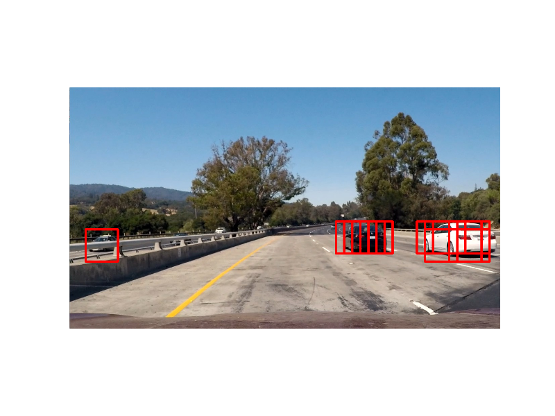

 

 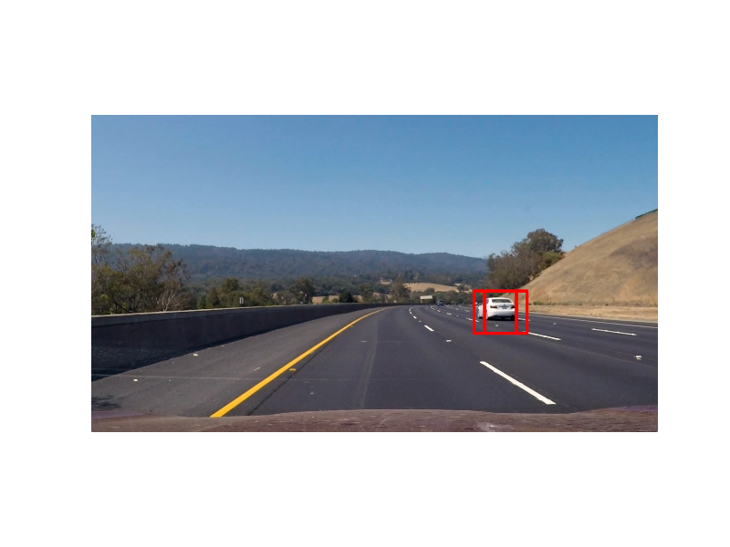

 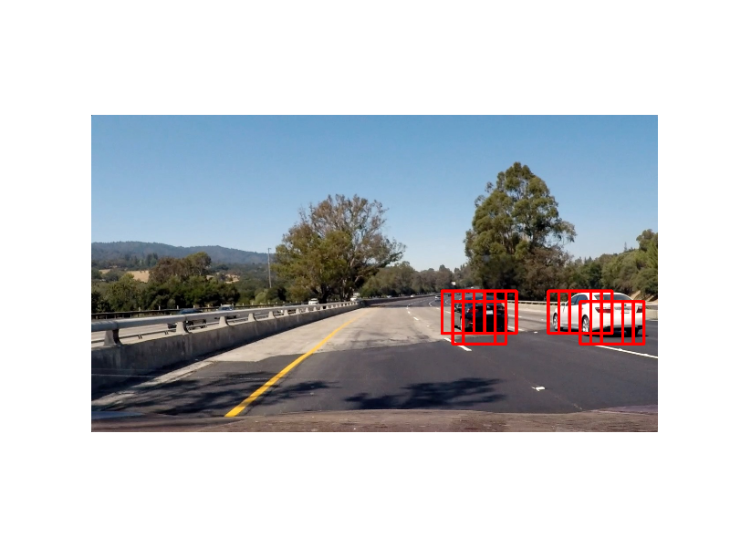

  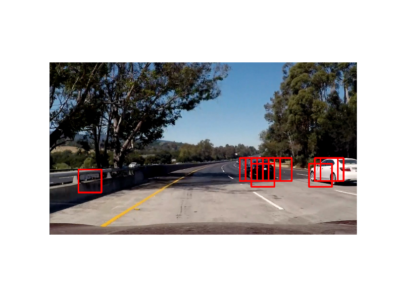

 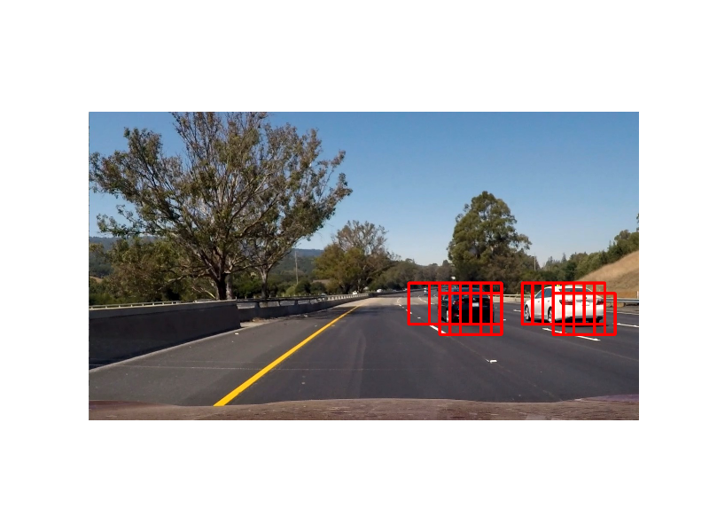

### Here are six frames, their corresponding heatmaps and final bounding boxes:
  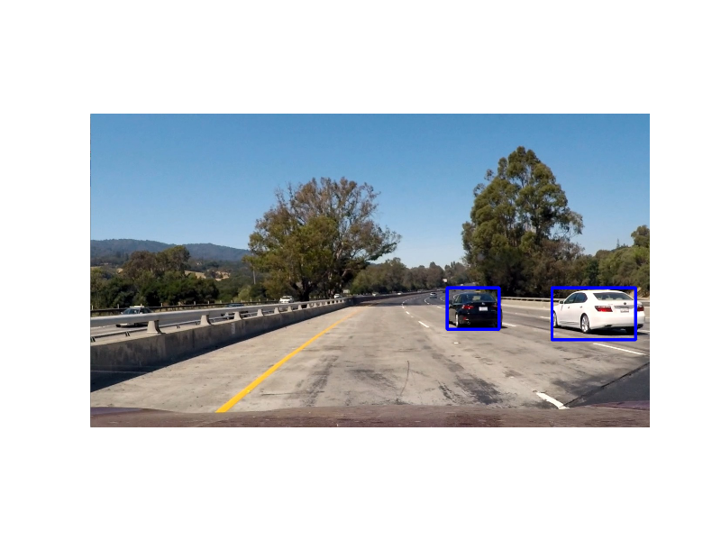

  

  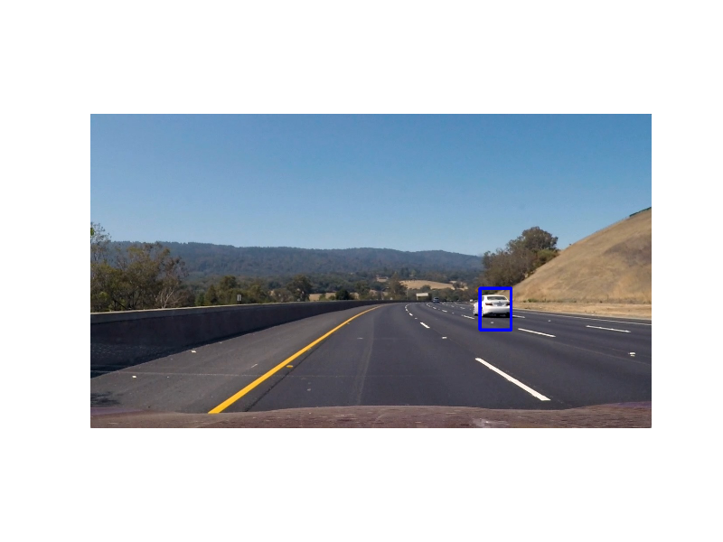

  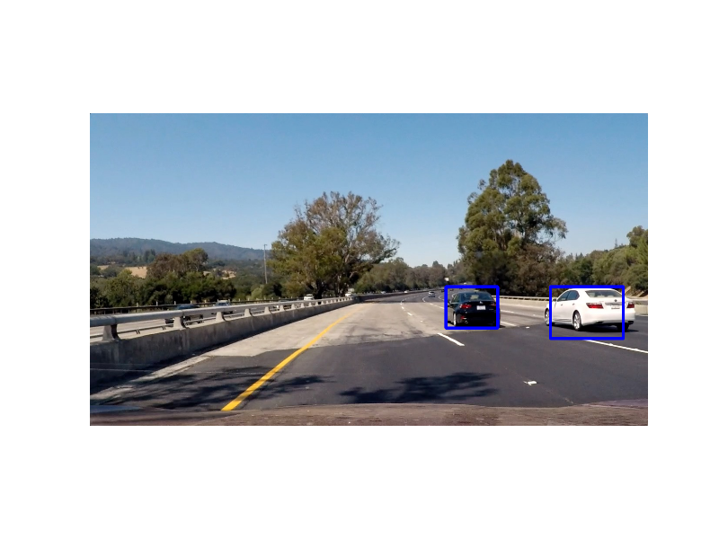

 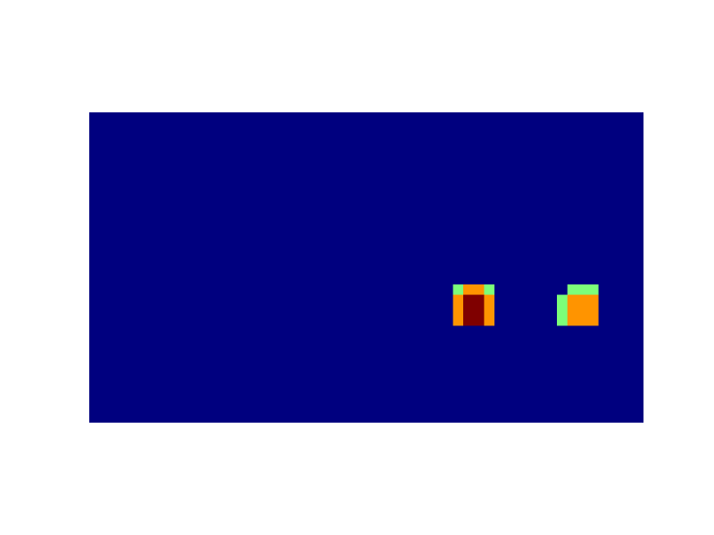 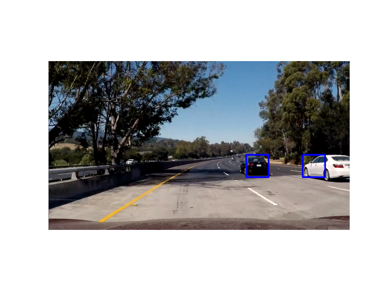

 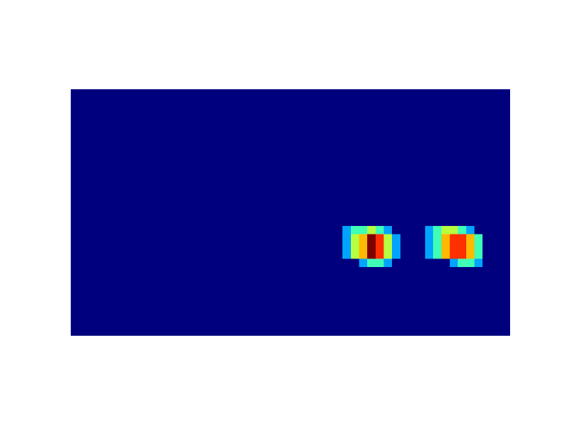 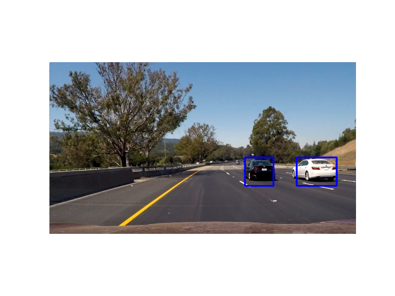

---

### 4. Video Implementation

Here's a [link to my video result](https://youtu.be/ixeJaC10Rl8)

---

### 5. Discussion
Shortcomings:
1. Search in multiple scales to detect cars that are further down the road
2. Much of the computations performed on the pipeline are computationally heavy and are not performant in real-time. 
3. Long feature vector length could be much reduced.

Improvements:
 1. use principal component analysis to reduce the dimensionality of the feature vector
 2. Use multiple scales while searching using sliding windows to improve the vehicle detection quality in more challenging videos.
 3. Recently, new deep learning based method such ash YOLO and SSD have been recorded very good performance on Detection and Tracking benchmark datasets.
 4. In order to improve real-time performance, benchmark/profile the functions and try to optimize the performance by focusing on improving performance for the largest offenders or implement them in CUDA or on an FPGA. 
